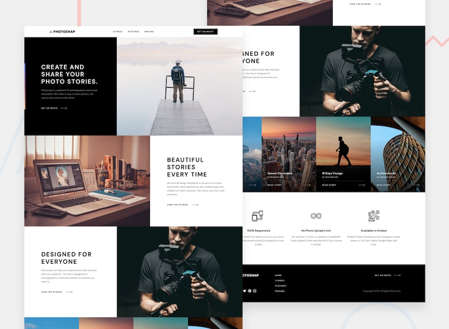

# Photosnap Website solution

## Table of contents

- [Overview](#overview)
  - [Links](#links)
- [My process](#my-process)
  - [Built with](#built-with)
  - [What I learned](#what-i-learned)
  - [Continued development](#continued-development)
  - [Useful resources](#useful-resources)
- [Author](#author)
- [Acknowledgments](#acknowledgments)

## Overview

### Website preview image



### Links

- GitHub Repository - [squad-014](https://github.com/Tjanelidze/squad-014)
- Live Site URL - [GitHub]()

## My process

### Built with

- Semantic HTML5 markup
- CSS custom properties
- Flexbox
- CSS Grid
- Mobile-first workflow

### What I learned

I've learned the 'img' tag's 'srcset' attribute along with the 'picture' tag, which I didn't use in this project cause just using 'img' tag with a 'srcset' attribute was way much more handy.

```html

```

In addition to this, I've learned various css selectors that really helped me to manipulate a specific element.

```css
input[type="checkbox"].toggle:checked ~ .yearly,
input[type="checkbox"].toggle:checked ~ .yearly::after {
  color: black;
  background-color: white;
}
```

This is simple functionality for toggle button. initially, the code was bigger but after some research, I boiled it down and that was my main takeaway.

```js
const check = document.querySelector("#check");
check.addEventListener("click", () => {
  zero.forEach((element) => {
    element.style.display = check.checked ? "inline-block" : "none";
  });
});
```

### Continued development

Through this project, we faced many obstacles and complications that made us see that we have a lot to learn ahead and not give up and keep on developing constantly. After that challenge, we going to move on to learning eloquent javascript and front-end libraries such as React. Following to this we looking forward to going on the back-end and becoming skillful full-stack developers.

### Useful resources

- [Responsive Burger Menu](https://www.youtube.com/watch?v=At4B7A4GOPg&t=709s) - This youtube tutorial helped me to build responsive header with a burger menu.
- [Toggle button](https://www.youtube.com/watch?v=N8BZvfRD_eU&t=811s) - This is an amazing youtube tutorial which helped me to make toggle button.

## Author

- Team Leads - Oto zakalashvili, Ani Avazneli, Tedo Janelidze
- Team Members - Zaza Gordeziani, Giorgi Gurgenidze

## Acknowledgments

This project is our very first collaboration project and we've been so excited from the get-go. Owing to we are juniors and this big project was overwhelming for the two of us, we get a lot of inspiration and motivation from each other, from our leads and lectors. Based on all that support we tackled our task and carried out it. Sincerely thankful and grateful to BitCamp for giving two of us and not just only two of us, but hundreds and thousands of people who just step into the tech industry to help us, giving us the right direction, giving us motivation, and which is the most important giving us such knowledge that gives us all opportunities to be the best around all over the world.
